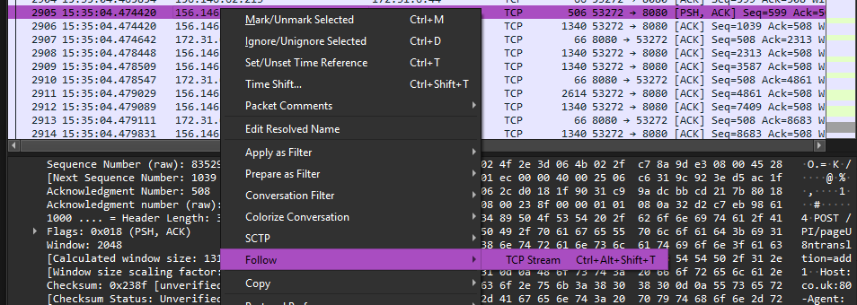
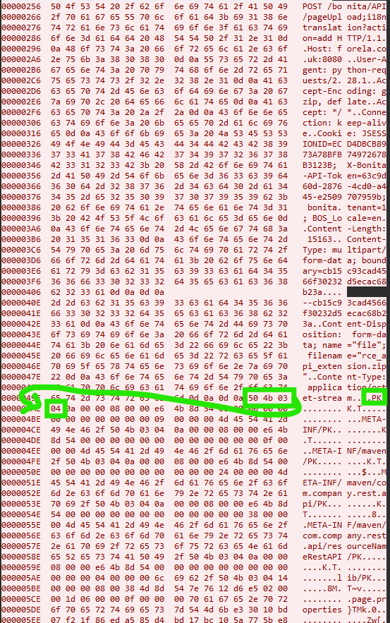

# 🦈 WireSharkFileExtractor 🔍

**Convert hexdumps back into files with ease!**  
WireSharkFileExtractor is a powerful tool that takes a hexdump and reconstructs it into its original file format,  
allowing for seamless recovery of captured network artifacts.

## ⚡ Features
- 🛠 Convert raw hexdumps into actual files
- 🏷️ Specify file type and output name
- 🚀 Fast and efficient processing

## 🔧 Usage
Usually you're gonna have a request which has the object which you want to retrieve. To now extract the file do the following: 
1. select with right clicking the packet and choose:
`follow -> TCP Stream`. 
2. In this dialog now select **Hex Dump** on the bottom of the window at the `Show as`-option. (should look like the screenshot below.)
3. Then select the full request containing the file in search and copy paste it into any editor of choice and save the file to a file which is used as hexdump parameter input.
3. Now run this tool:
```bash
python transformer.py -hexdump "path/to/hexdump/dump.txt" -output "path/to/future/output/file" -filetype "zip"
```

Internally the tool then just runs over the request given and searches for the magic bytes of the selected filetype:
 <br>
In this case the given filetype would be zip and the marked elements in the hex representation is the bytes the program is gonna search.

> [!IMPORTANT]  
> It is crucial to store the data as it is shown in the screenshot above, as the parsing is expecting that exact format.


### Why this tool
In a sherlock challenge in HTB i tried to extract files sent to a certain web server by an adversary.
There is the possibility to extract files from wiresharks menu: `File -> Export Objects..`. 
<br>Unfortunately, the file I was searching for wasnt available to extract.
In the search of an easy way to do that i didn't really find a useful way to go. <br>
So i decided i just implement it myself and maybe someone can use it too :)

### Supported magic bytes:
- Windows executables
  - "exe" | "dll" | "mui" | "sys"| "scr"| "cpl"| "ocx"| "ax"| "iec"| "ime"| "rs"| "tsp"| "fon"| "efi"
- Linux executables 
  - "none" | "axf" | "bin" | "elf" | "o" | "out" | "prx" | "puff" | "ko" | "mod" | "so"
- Archives
  - "zip" | "aar" | "apk" | "docx" | "epub" | "ipa" | "jar" | "kmz" | "maff" | "msix" | "odp" | "ods" | "odt" | "pk3" | "pk4" | "pptx" | "usdz" | "vsdx" | "xlsx" | "xpi" | "whl" | "tar"
- Microsoft COM compound file binary format
  - "doc" | "xls" | "ppt" | "msi" | "msg"
- PDF
